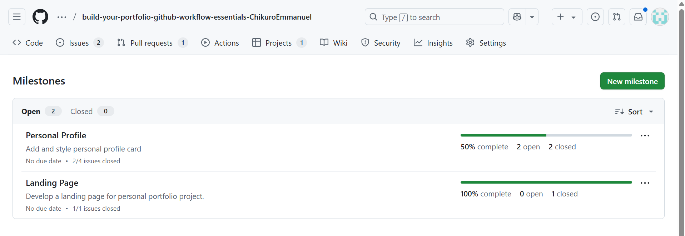
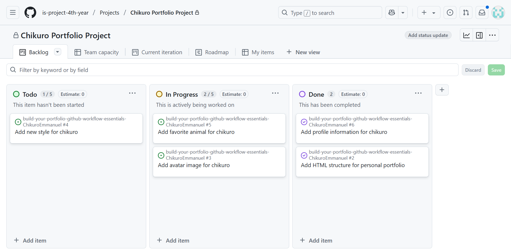
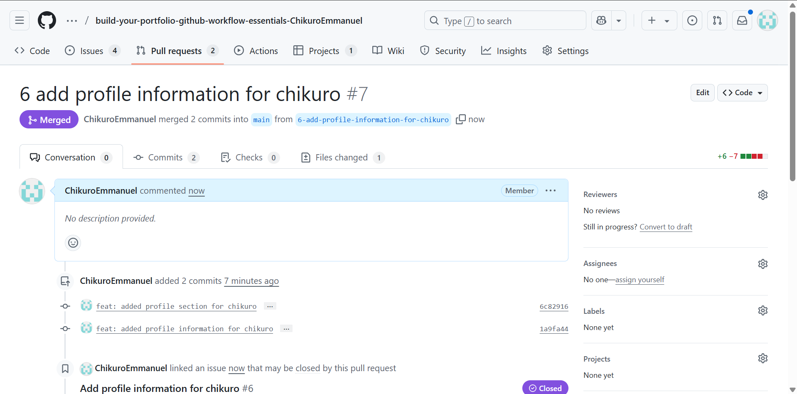

# Personal Portfolio Documentation

## 1. Student Details

- **Full Name**: Chikuro Emmanuel Mbaji
- **GitHub Username**: ChikuroEmmanuel
- **Email**: Chikuro.Mbaji@strathmore.edu

## 2. Deployed Portfolio Link

- **GitHub Pages URL**:  
   https://is-project-4th-year.github.io/build-your-portfolio-github-workflow-essentials-ChikuroEmmanuel/

## 3. Learnings from the Git Crash Program

**Four key concepts** 
- **Branching**:
  - Helped me separate features and prevent conflicts when working on            different site sections. 
- **Commit Messages**:
  - Using structured and meaningful commit messages helped me track changes.
  - It became easier to understand what was done at each stage. An Example       of a commit message I used was: "feat: add an avatar icon for chikuro".
- **Pull Requests and Code Review**:
  - Pull requests enabled me to review and test changes before merging them      into the main branch.
  - I also put myself as the reviewer since it was a personal project. 
- **Issues and Milestones**:
  - Creating issues for each task and linking them to milestones helped          break down the work into small, manageable parts.


## 4. Screenshots of Key GitHub Features

Include screenshots that demonstrate how you used GitHub to manage your project. For each screenshot, write a short caption explaining what it shows.

> Upload the screenshots to your GitHub repository and reference them here using Markdown image syntax:
> (you could just simply copy and paste the image into the Assignment.md)

```markdown

```

### A. Milestones and Issues

-  

### B. Project Board

-  

### C. Branching

-  

### D. Pull Requests

-  

### E. Merge Conflict Resolution

- 
